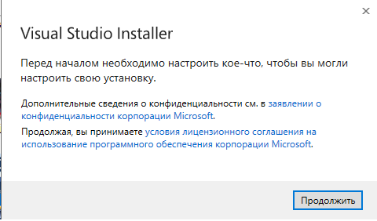
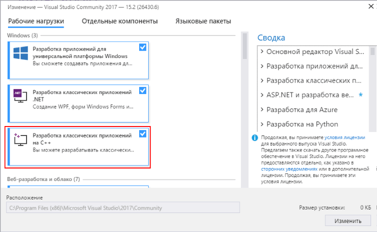

# Конспект 1

## Зачем нам _среда программирования_?

<i>Среда программирования</i> - это комплекс программ, позволяющих программисту писать программу, исправлять ошибки, запускать программу, исправлять ошибки, запускать программу на выполнение, отлаживать программу и получать результат. При этом задействовать различные системные программы, такие как:

- Редактор текста
- Отладчик
- Компилятор
- Стандартные библиотеки и др.

## Установка среды разработки

- [Windows](#установка-visual-studio)
- [Linux](#установка-codeblocks)
  > После установки среды, переходите [сюда](#послесловие)

### Установка [Visual Studio Community](https://visualstudio.microsoft.com/ru/vs/community/)

Visual Studio Community - это IDE<sup>1</sup>, от Microsoft, которая позволяет разрабатывать приложения на различных языках, которые развивает и поддерживает сама компания (C/C++, C#, Python3 и прочие). Это один из самых распространённых программных комплексов для создания ПО для операционной системы Windows.<br>

#### 1. Скачивание дистрибутива<sup>2</sup> VS Community

Для установки среды разработки потребуется установочный файл. Скачать его можно по этой [ссылке](https://disk.yandex.ru/d/jVauj6_ciDlPsw) (ссылка на Яндекс.Диск из-за трудной ситуации в мире).

#### 2. Установка Visual Studio

Откройте скачанный файл и нажмите <span style="color:green">продолжить</span>.<br><br>
<br>
Дождитесь завершения загрузки необходимых компонентов.<br>
Выберите опцию <span style="color: green">Разработка классических приложений на C++</span>.

<br>
Нажмите кнопку <span style="color: green">ОК</span> и дождитесь установки необходимых пакетов, после чего можете закрыть установщик и радоваться жизни `:)`.<br>

> Мои поздравления! Вы только что установили на свой рабочий компьютер среду разработки.

### Установка Code::Blocks

Code::Blocks - это IDE с _открытым исходным кодом_<sup>3</sup>, так же, как и VS Community довольно распространена среди сообщества программистов. Она разрабатывается энтузиастами и на ней можно разрабатывать _кроссплатформенные_<sup>4</sup> приложения. Я рекомендую использовать эту IDE на Linux, поскольку она самая простая для начинающих программистов.<br>
Установка пакета в Linux довольно простая: откройте терминал и ввыедите одну из команд (в зависимости от дистрибутива операционной системы):

```sh
# Debian/Ubuntu и их производные:
sudo apt-get update
sudo apt-get install codeblocks

# Arch Linux и производные:
sudo pacman -Syu
sudo pacman -Sy codeblocks

# Пользователи остальных дистрибутивов могут самостоятельно найти решение в Интернете, поскольку если я начну описывать каждый отдельный случай, то просто не закончу этот конспект :)
```

## Послесловие

В данной серии конспектов Visual Studio Community Edition будет использоваться как основная среда разработки приложений, поскольку подавляющее большинство читателей вероятнее всего используют Windows `и боятся перейти на Linux гы гы гы`.

## Примечания

---

<sup>1</sup>IDE - (англ. Integrated Development Environment) Интегрированная (единая) среда разработки, то же самое, что и `среда разработки`.<br>
<sup>2</sup>Дистрибутив — это комплект (как правило, набор файлов), приспособленный для распространения ПО. Может включать вспомогательные инструменты для автоматизированной начальной настройки программы (установщик).<br>
<sup>3</sup>Открытый исходный код – это исходный код, который находится в свободном доступе для возможной модификации и распространения. Продукты включают разрешение на использование исходного кода, проектной документации, или содержания продукта.
<sup>4</sup>Кроссплатформенность — способность программного обеспечения работать с несколькими аппаратными платформами или операционными системами. Простыми словами, вы можете запустить своё приложение на чём угодно (компьютер, телефон, телевизор, ~~микроволновка, утюг...~~).

## Что почитать?

---

`скоро найду`

---

[<u>_Предыдущий конспект_</u>](/summaries/summary0.md) ╝╗╝╗╝╗ [<u>_Следующий конспект_</u>](/summaries/summary2.md)
