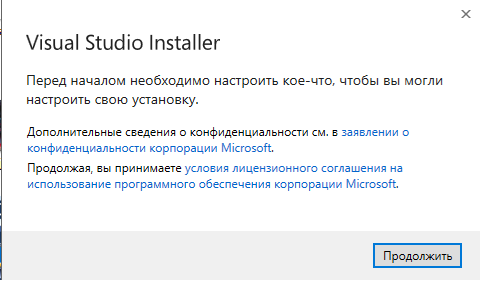

# Конспект 1

## Установка среды разработки
- [Windows](#установка-visual-studio)

### Установка [Visual Studio Community](https://visualstudio.microsoft.com/ru/vs/community/)

Visual Studio Community - это IDE1, от Microsoft, которая позволяет разрабатывать приложения на различных языках, которые развивает и поддерживает сама компания (C/C++, C#, Python3 и прочие). Это один из самых распространённых программных комплексов для создания ПО для операционной системы Windows. 

#### 1. Скачивание дистрибутива2 VS Community

Для установки среды разработки потребуется установочный файл. Скачать его можно по этой [ссылке](https://disk.yandex.ru/d/jVauj6_ciDlPsw) (ссылка на Яндекс.Диск из-за трудной ситуации в мире).

#### 2. Установка Visual Studio

Откройте скачанный файл и нажмите продолжить.  
 
Дождитесь завершения загрузки необходимых компонентов. 
Выберите опцию Разработка классических приложений на C++.

 
Нажмите кнопку ОК.